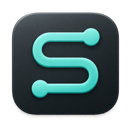
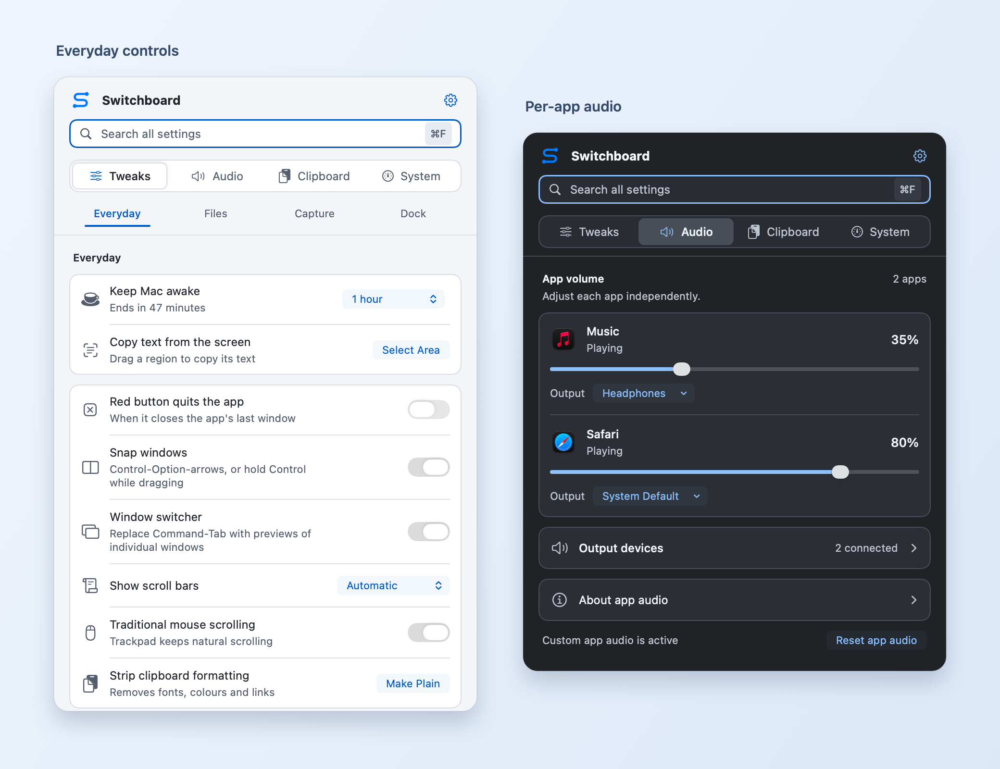
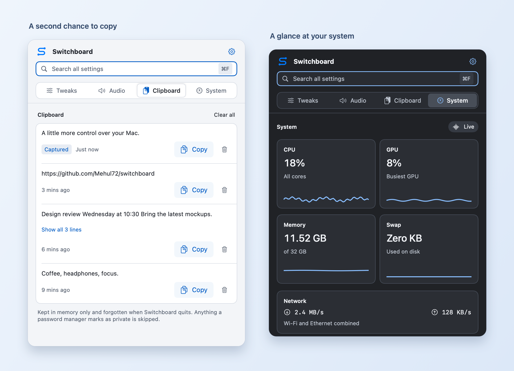

  

<h1 align="center">Switchboard</h1>

  <strong>A little more control over your Mac.</strong> 
  Everyday settings, per-app audio, clipboard history, and window tools. 
  All in your menu bar.

  <a href="https://github.com/Mehul72/switchboard/releases/latest"><strong>Download for macOS →</strong></a> 
  Requires macOS 14.2 or later

  <a href="#get-started">Get started</a> ·
  <a href="docs/user-guide.md">User guide</a> ·
  <a href="https://github.com/Mehul72/switchboard/releases">Release notes</a> ·
  <a href="https://github.com/Mehul72/switchboard/issues">Report an issue</a>

Switchboard's native interface, rendered with example settings and audio apps.

## Small tools you'll reach for every day

| Feature | What you can do |
| --- | --- |
| **Make macOS yours** | Keep your Mac awake, change mouse scrolling without affecting the trackpad, and adjust Finder, Dock, and screenshot settings. |
| **Turn down just one app** | Set a volume and output device for each app. Keep music quiet and calls clear. |
| **Find what you copied** | Bring back your last 20 text and image clips. Copy text straight from a region of your screen. |
| **Put windows in place** | Snap to halves, quarters, or thirds with shortcuts, or hold Control while dragging to use a grid. Move windows between displays. |
| **Switch windows, not just apps** | Use Command-Tab to choose individual windows, including multiple windows of the same app. Enable previews to see them before switching. |
| **See how your Mac is doing** | Check CPU, GPU, memory, network, disk, and battery readings without opening another app. Sensor availability varies by Mac. |

Clipboard and System views with example content and readings. Light and dark appearances follow macOS.

## Get started

1. **[Download the latest release](https://github.com/Mehul72/switchboard/releases/latest)** and open the `.dmg` file.
2. **Drag Switchboard into Applications**, then launch it from there.
3. **Click the Switchboard icon in your menu bar.** The welcome window helps you find it.

Press **Command-F** in the panel to search every setting. Most changes apply immediately; settings that need Finder or the Dock to restart show a restart button.

Want it ready when you log in? Open the **settings gear > Launch at Login**.

### Start with the keyboard

These defaults work from any app while Switchboard is running. Change them in **settings gear > Keyboard Shortcuts**.

| Action | Shortcut |
| --- | --- |
| Show or hide Switchboard | ⌃⌥⌘S |
| Open clipboard history | ⌃⌥⌘V |
| Copy text from the screen | ⌃⌥⌘T |
| Toggle keep-awake | ⌃⌥⌘A |

⌃ Control · ⌥ Option · ⌘ Command

**Window snapping and the window switcher are off by default.** Enable them in **Tweaks > Everyday**. Snapping uses Control-Option shortcuts; the switcher replaces Command-Tab while enabled. [See the window controls and customisation options →](docs/user-guide.md#window-snapping)

## Your Mac, your permissions

Switchboard asks for access when you first use a feature that needs it.

| Permission | What it's for |
| --- | --- |
| **Accessibility** | Window snapping and switching, traditional mouse scrolling, and quitting apps when their last window closes. |
| **Screen Recording** | Copying text from the screen and optional window previews. The switcher also works with icons and titles. |
| **System Audio Recording** | Adjusting individual apps' volume or audio output. macOS shows a purple recording indicator while these controls are active. |

Manage access in **System Settings > Privacy & Security**. If a feature stays off after you grant access, enable it again. Screen Recording may require relaunching Switchboard.

Clipboard history and window thumbnails stay in memory. Clipboard history clears when you quit, and content marked private by password managers is skipped. Switchboard does not send clipboard content or usage data to a server.

To undo system preference changes, choose **settings gear > Restore Original Settings**. For audio, use **Reset app audio** in the Audio tab.

## Go further

- **[User guide](docs/user-guide.md):** window layouts, switcher controls, shortcut customisation, audio routing, and clipboard behaviour.
- **[Contributing](CONTRIBUTING.md):** build from source, run tests, or work on Switchboard. Requires Xcode 16 or later; no package dependencies.
- **[Issues](https://github.com/Mehul72/switchboard/issues):** report a bug with your macOS version and steps to reproduce it.
