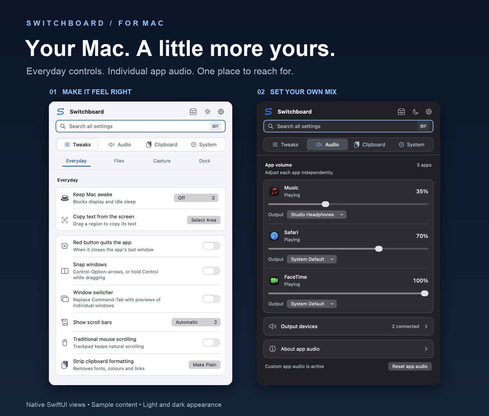
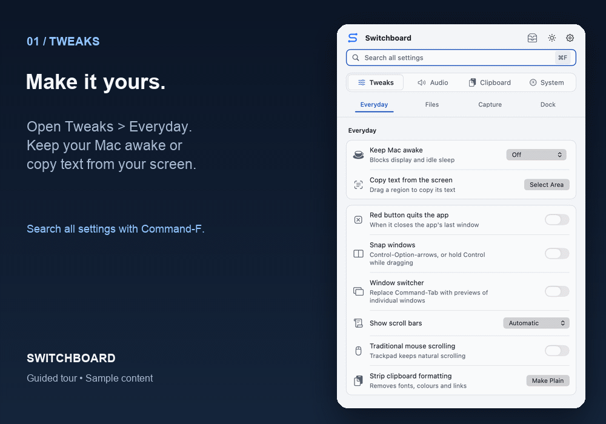
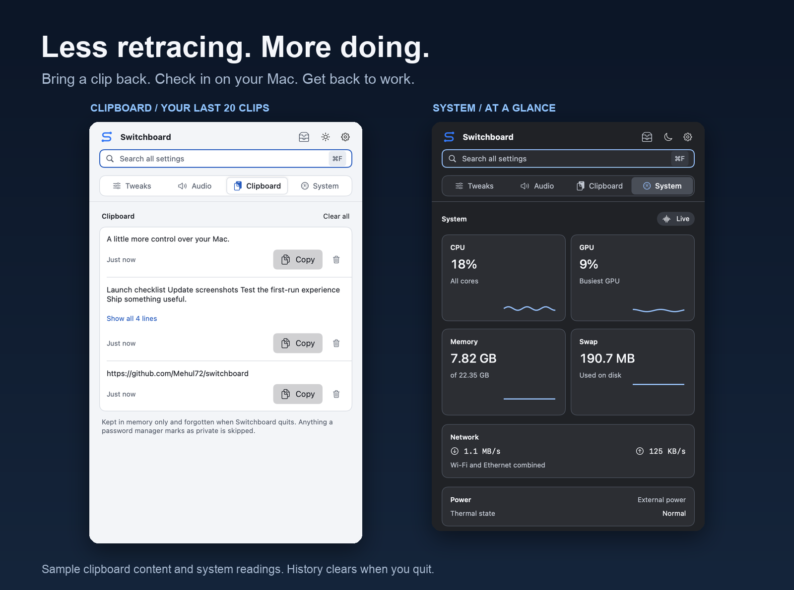

  

<h1 align="center">Switchboard</h1>

  <strong>A little more control over your Mac.</strong> 
  App audio, clipboard history, a file shelf, window tools, and everyday settings. 
  Right where you need them: your menu bar.

  <a href="https://github.com/Mehul72/switchboard/releases/latest"><strong>Download for macOS →</strong></a>
  &nbsp; · &nbsp;
  <a href="docs/user-guide.md"><strong>Read the guide</strong></a>

macOS 14.2 or later · Native SwiftUI · No account to create

  <a href="#get-started">Get started</a> ·
  <a href="#take-a-look">Take a look</a> ·
  <a href="#learn-the-shortcuts">Shortcuts</a> ·
  <a href="#permissions-and-privacy">Privacy</a> ·
  <a href="#need-a-hand">Help</a>

Native app views with sample data. Walkthroughs are rendered examples, not desktop recordings. Click any image for a closer look.

## Get started

1. **[Download the latest release](https://github.com/Mehul72/switchboard/releases/latest).** Under **Assets**, choose `Switchboard-<version>.dmg`, not the source-code archive.
2. **Open the DMG and drag Switchboard to Applications.** Then open **Applications > Switchboard**. You can eject the installer afterward.
3. **Choose Open Switchboard in the welcome window.** After that, click its icon in the menu bar at the top of your screen, or press **Control-Option-Command-S**.

**Try this first: bring back something you copied.**

Copy `Hello, Switchboard` from this page. Copy a second piece of text. Open **Clipboard**, find the first clip, and click its **Copy** button. Return to a text editor and press **Command-V**. Your earlier text is back. No extra permissions needed.

> Switchboard runs in the menu bar, so you won't find a normal app window or Dock icon. Keep it in Applications. Enable **settings gear > Launch at Login** when you want it ready after signing in.

[Installation help and your first five minutes →](docs/user-guide.md#installation-and-first-launch)

## Take a look

[App audio](#your-music-your-call-your-mix) · [Screen text](#copy-the-text-you-cant-select) · [Clipboard](#copy-once-come-back-later) · [File shelf](#give-your-files-a-layover) · [Disks](#done-with-that-disk) · [Window switcher](#find-the-window-you-meant) · [Snapping](#make-room-for-your-work) · [System monitor](docs/user-guide.md#system-monitor)

<strong>Play the 20-second visual tour</strong> (animated, sample content)

Prefer still images? Open [Tweaks](docs/images/everyday-light.png), [Audio](docs/images/audio-dark.png), [Clipboard](docs/images/clipboard-light.png), or [System](docs/images/system-dark.png).

### Your music. Your call. Your mix.

**Turn down one app. Send it to a different output.** Keep the rest of your mix as it is. Open **Audio** while an app is playing; your first adjustment asks for System Audio Recording access.

[Still image](docs/images/app-audio.png) · [Audio controls →](docs/user-guide.md#audio)

### Copy the text you can't select

**Control-Option-Command-T → drag around the words → paste with Command-V.** Useful for text in screenshots, slides, and images. Requires Screen Recording; recognition depends on the image's clarity.

[Still image](docs/images/screen-text.png) · [Screen text capture →](docs/user-guide.md#everyday-tools)

### Copy once. Come back later.

Text, images, and text captured from your screen are easy to find again. Use **Control-Option-Command-V** to open history from another app, copy the item you need, and paste as usual.

Clipboard history stays in memory and clears when you quit. System readings vary by Mac; the numbers shown here are examples.

### Give your files a layover

**Drag a file → press Shift or shake the pointer → drop to keep.** Collect from different folders, then drag a thumbnail into the app you need. The shelf holds up to **40 references** until you quit; originals stay where they are.

[Still image](docs/images/file-shelf-workflow.png) · [Shelf controls →](docs/user-guide.md#file-shelf-and-disks)

### Done with that disk?

**The same shelf handles external drives and mounted disk images.** Click Eject, or drag a disk onto **Drop to eject**. Hovering does nothing; busy disks report an error instead of being force-ejected.

[Still image](docs/images/disk-eject.png) · [Disk controls →](docs/user-guide.md#file-shelf-and-disks)

### Find the window you meant

**Hold Command and press Tab** to browse individual windows. Release Command to switch. **Option + `** browses just the current app.

Enable **Tweaks > Everyday > Window switcher** and allow Accessibility. Previews optionally use Screen Recording.

[Still image](docs/images/window-switcher.png) · [Switcher controls →](docs/user-guide.md#window-switcher)

### Make room for your work

**Halves, thirds, quarters, or the whole workspace.** Enable **Tweaks > Everyday > Snap windows** and allow Accessibility. Each step above shows its default shortcut.

[Still image](docs/images/window-snapping.png) · [All layouts and shortcuts →](docs/user-guide.md#window-snapping)

### Or just drag it into place

**Drag the title bar → hold Control → sweep out a layout → release the mouse.** Let go of Control first to cancel snapping.

[Still image](docs/images/window-grid.png) · [Drag controls →](docs/user-guide.md#window-snapping)

Window walkthroughs use the native switcher and grid with example content. Snapped positions come from Switchboard's layout code. These are rendered demonstrations, not desktop recordings. Both window features start off.

## Learn the shortcuts

These defaults work from any app while Switchboard is running.

| Action | Keys to press together |
| --- | --- |
| Show or hide Switchboard | **Control + Option + Command + S** |
| Open clipboard history | **Control + Option + Command + V** |
| Open file shelf and disks | **Control + Option + Command + F** |
| Copy text from the screen | **Control + Option + Command + T** |
| Toggle keep-awake | **Control + Option + Command + A** |

Inside the panel, **Command-F** searches all settings. **Escape** clears a search; press it again to close the panel. The appearance button beside the gear lets you choose **Light**, **Dark**, or **Match System**.

[Customise shortcuts →](docs/user-guide.md#customising-shortcuts) · [See dark appearance →](docs/images/everyday-dark.png)

## Permissions and privacy

Start with the features you need. Switchboard asks for access when a feature requires it.

| Permission | Used for |
| --- | --- |
| **Accessibility** | Window snapping and switching, traditional mouse scrolling, quitting an app when its last window closes, and ejecting selected disks with Command-Delete in Finder. |
| **Screen Recording** | Copying text from the screen and optional window previews. Switching with icons and titles works without previews. |
| **System Audio Recording** | Per-app volume and output routing. macOS shows a purple recording indicator while these controls are active. |

Manage permissions in **System Settings > Privacy & Security**. After granting access, try the feature again. Screen Recording may require a relaunch.

Clipboard history, shelf references, and window thumbnails stay in memory. Content marked private by password managers is skipped. Switchboard does not send clipboard content or usage data to a server. Shelf items and clips disappear when you quit; your original files stay put.

To reverse preference changes, use **settings gear > Restore Original Settings**. To release per-app audio controls, use **Audio > Reset app audio**. Output-device volume is separate.

[Permission details →](docs/user-guide.md#permissions) · [Restore settings or uninstall →](docs/user-guide.md#restore-settings-or-uninstall)

## Need a hand?

<strong>I opened the app, but can't find it.</strong>

Look in the menu bar at the top of your screen, or press **Control-Option-Command-S**. Switchboard doesn't use a Dock icon. If the shortcut does nothing, open Switchboard from Applications first. See [troubleshooting](docs/user-guide.md#troubleshooting).

<strong>An app is missing from Audio.</strong>

Play something in that app, then open Audio again. Apps appear after opening an audio stream. Your first volume or output adjustment asks for System Audio Recording access.

<strong>Snapping or the window switcher doesn't work.</strong>

Enable the feature in **Tweaks > Everyday**, grant Accessibility access, then try again. Snapping acts on the focused window and does not move macOS full-screen windows. Check **Keyboard Shortcuts** for a disabled or conflicting binding.

<strong>My clipboard history or shelf is empty after relaunching.</strong>

That's expected. Both stay in memory for the current session. The shelf's original files are still in their original folders.

**[User guide](docs/user-guide.md)** · **[Report a bug](https://github.com/Mehul72/switchboard/issues/new?template=bug_report.yml)** · **[Request a feature](https://github.com/Mehul72/switchboard/issues/new?template=feature_request.yml)** · **[Release notes](https://github.com/Mehul72/switchboard/releases)**

---

### Build something with us

Switchboard is written in Swift and SwiftUI, with no package dependencies. To build from source, clone the repository and open `Switchboard.xcodeproj` in **Xcode 16 or later**. Select **Switchboard > My Mac**, choose your signing team if needed, and press **Command-R**.

See **[Contributing](CONTRIBUTING.md)** for tests, signing, and release instructions, or **[maintaining these visuals](docs/media.md)** to refresh the screenshots after a UI change.
