

  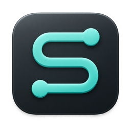

<h1 align="center">Switchboard</h1>

  <strong>A few small fixes for everyday Mac annoyances.</strong> 
  Give each app its own volume. Find that thing you copied. 
  Get your windows where you want them, all from the menu bar.

  <a href="https://github.com/Mehul72/switchboard/releases/latest"><strong>Download for macOS</strong></a>
  &nbsp; · &nbsp;
  <a href="#install">Install</a>
  &nbsp; · &nbsp;
  <a href="docs/user-guide.md">User guide</a>
  &nbsp; · &nbsp;
  <a href="#30-second-tour">See the tour</a>

macOS 14.2 or later · No account needed · Built with SwiftUI

## 30-second tour

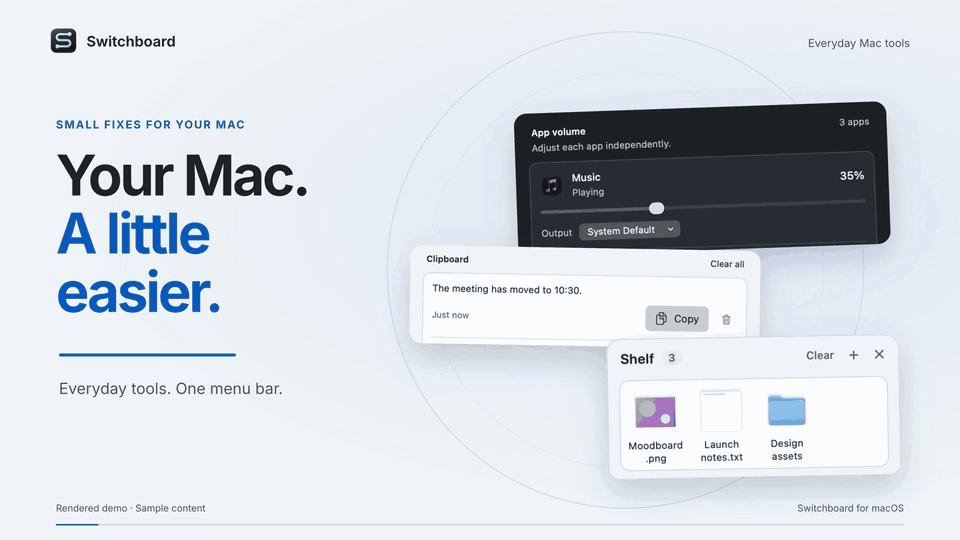

<a href="https://github.com/Mehul72/switchboard/raw/refs/heads/main/brag-output/brag.mp4"><strong>Download the 4K video with sound</strong></a> · <a href="brag-output/brag.jpg">View the still poster</a> The preview above is silent. The 4K MP4 includes music and interaction sounds. Find instructions for every feature in the <a href="docs/user-guide.md#30-second-tour">user guide</a>.

Native app views with sample content, refreshed October 2026. The demos are rendered examples, not desktop recordings. Each has a still image and a playable MP4.

Switchboard is a little utility that lives at the top of your screen. Open it when you need a setting, or use a shortcut without leaving the app you're in. Start with whichever tool solves something annoying for you.

  <a href="#audio">App audio</a> ·
  <a href="#file-shelf">File shelf</a> ·
  <a href="#clipboard">Clipboard</a> ·
  <a href="#screen-text">Screen text</a> ·
  <a href="#windows">Windows</a> ·
  <a href="#system">System</a>

## Audio

### Give each app its own volume knob

Music a bit loud during a call? Lower just Music. You can also send an app to your headphones while the others use the default output.

  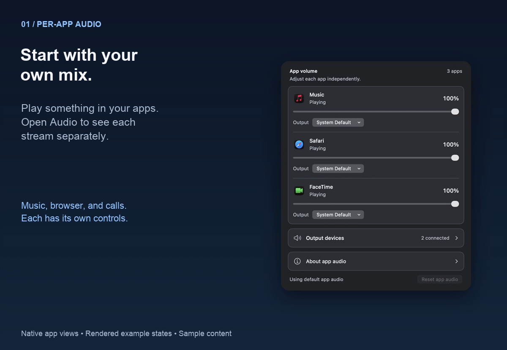

Open **Audio** while something is playing. Each app gets a volume slider and an output menu. The first adjustment asks for System Audio Recording access.

Your output choice is remembered for each app. Its volume returns to 100% when the app quits. **Reset app audio** clears both adjustments and saved output choices.

[Audio guide](docs/user-guide.md#audio) · [Still image](docs/images/app-audio.png) · [Download MP4](https://github.com/Mehul72/switchboard/raw/refs/heads/main/docs/videos/app-audio.mp4)

## File shelf

### A spare hand for your files

You're attaching a few files to an email, and they're all in different folders. Start dragging one, press **Shift**, and drop it on the shelf. Add the others as you find them, then drag them into the email.

  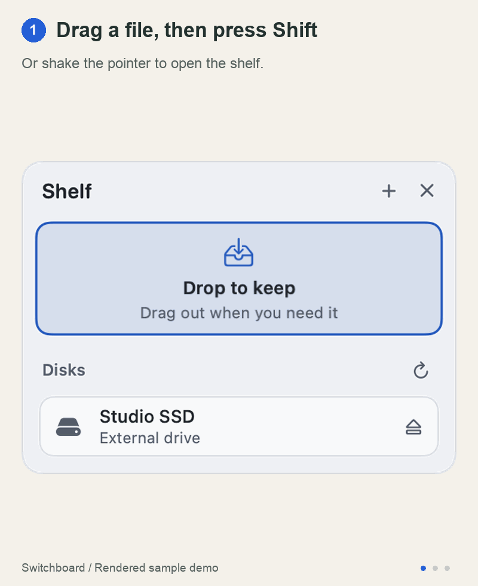

Shaking the pointer during a drag opens it too. The shelf holds up to 40 files or folders and leaves the originals where they are. It clears when you quit Switchboard.

[File shelf guide](docs/user-guide.md#file-shelf-and-disks) · [Still image](docs/images/file-shelf-workflow.png) · [Download MP4](https://github.com/Mehul72/switchboard/raw/refs/heads/main/docs/videos/file-shelf.mp4)

The shelf can eject disks, too

External drives and mounted disk images appear below your files. Click **Eject**, or drag a disk onto **Drop to eject**. Wait for the confirmation before unplugging it. If a disk is busy, Switchboard tells you and leaves it mounted.

  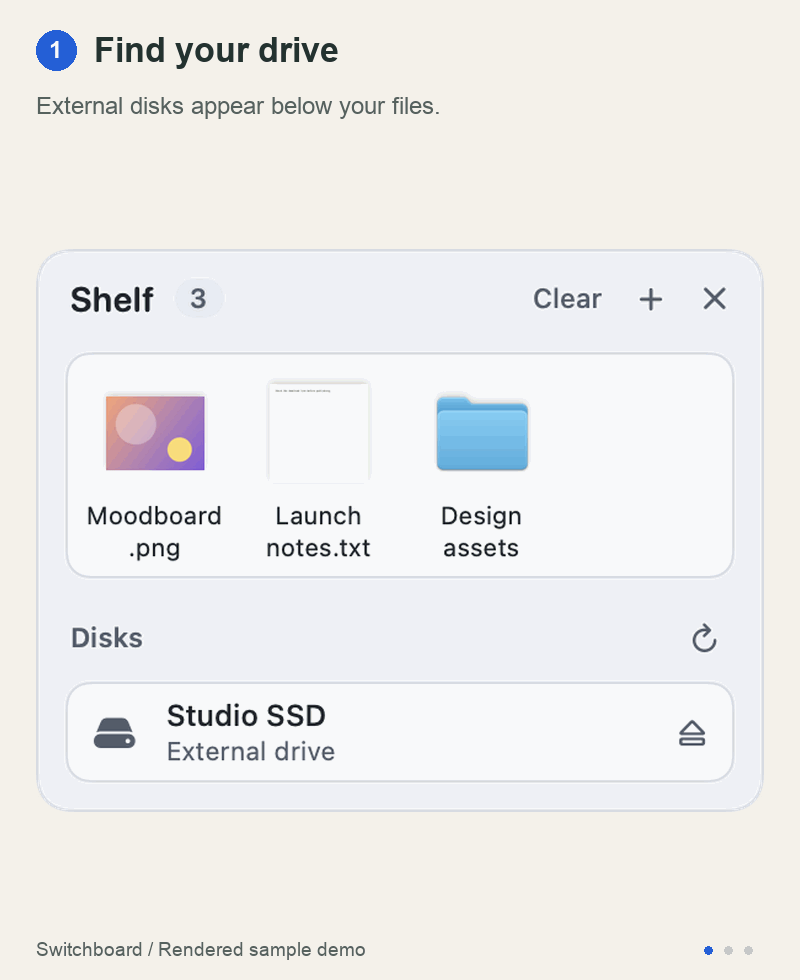

With Accessibility access, **Command-Delete** also ejects disks selected in Finder. Ordinary files still go to the Trash, and typing or renaming keeps its normal behavior.

[Disk controls](docs/user-guide.md#eject-a-disk) · [Still image](docs/images/disk-eject.png) · [Download MP4](https://github.com/Mehul72/switchboard/raw/refs/heads/main/docs/videos/disk-eject.mp4)

## Clipboard

### The thing you copied before the thing you just copied

It's still there. Open Clipboard, find the earlier item, and click **Copy**. Then paste into your app as usual. Text and images both work.

  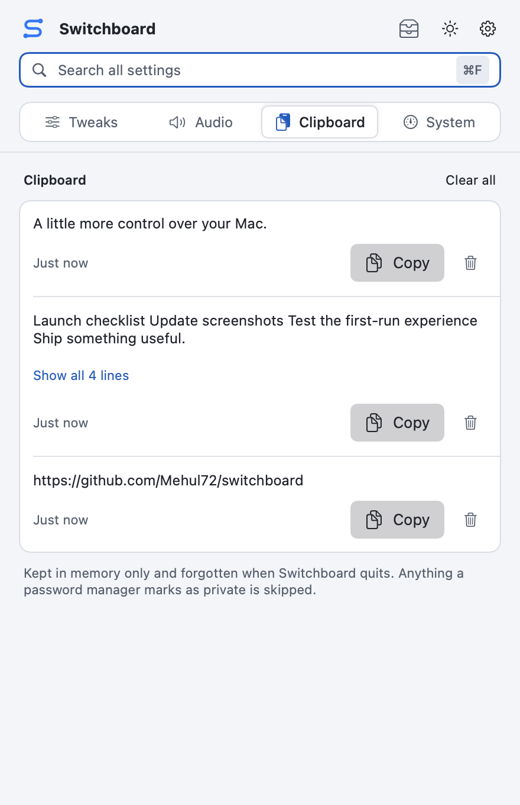

Press **Control-Option-Command-V** to open history from anywhere. It keeps your last 20 clips while Switchboard is running, then forgets them when you quit. Content marked private by a password manager is skipped.

Turn off **settings gear > Record Clipboard History** to stop recording and clear the list.

[Clipboard guide](docs/user-guide.md#screenshots-and-clipboard)

## Screen text

### Save yourself the retyping

A date in a screenshot. A paragraph on a slide. Text you can see but can't select. Press **Control-Option-Command-T**, draw a box around it, and paste with **Command-V**.

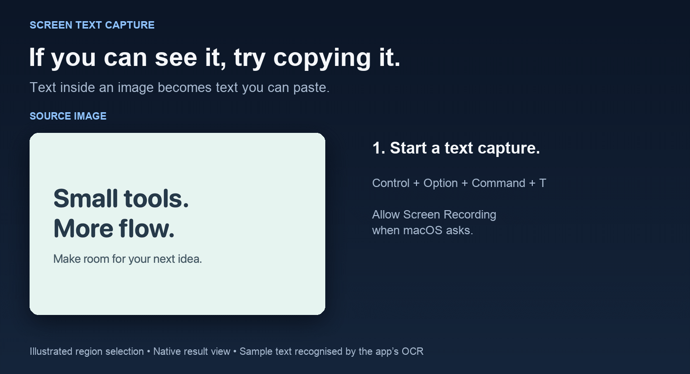

Requires Screen Recording. Check the result before using it; small or blurry text can trip it up.

[Screen text guide](docs/user-guide.md#copy-text-from-the-screen) · [Still image](docs/images/screen-text.png) · [Download MP4](https://github.com/Mehul72/switchboard/raw/refs/heads/main/docs/videos/screen-text.mp4)

## Windows

### Find the window buried behind everything

Two browser windows should be two choices. Switchboard's **Window switcher** gives each window its own card. Hold **Command**, tap **Tab** until you reach the one you want, and release.

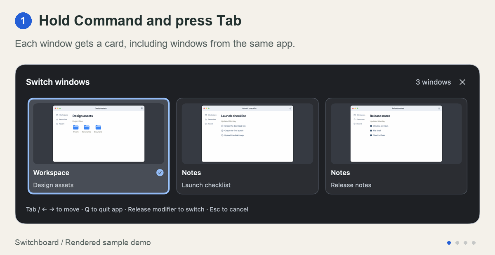

Use **Option + `** to browse just the current app. Turn the switcher on in **Tweaks > Everyday** and allow Accessibility. Previews optionally use Screen Recording.

[Window switcher guide](docs/user-guide.md#window-switcher) · [Still image](docs/images/window-switcher-demo.png) · [Download MP4](https://github.com/Mehul72/switchboard/raw/refs/heads/main/docs/videos/window-switcher.mp4)

### Put a window in its place

Half the screen for your editor, a third for your notes, or the whole workspace when you need it. Snap with the keyboard and restore the old size when you're done.

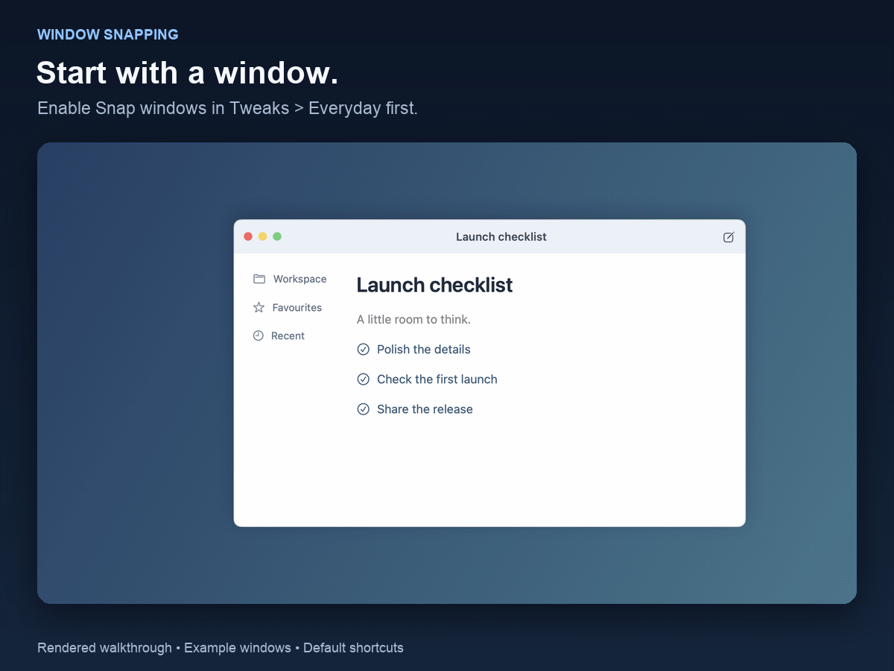

Enable **Tweaks > Everyday > Snap windows** and allow Accessibility. Both window tools start off, so you can choose when to give them control of your shortcuts.

[Layouts and shortcuts](docs/user-guide.md#window-snapping) · [Still image](docs/images/window-snapping.png) · [Download MP4](https://github.com/Mehul72/switchboard/raw/refs/heads/main/docs/videos/window-snapping.mp4)

Prefer dragging? Try the grid.

Drag a window by its title bar, then hold **Control**. Move across the grid to choose its size and release the mouse to snap. Release Control first if you change your mind.

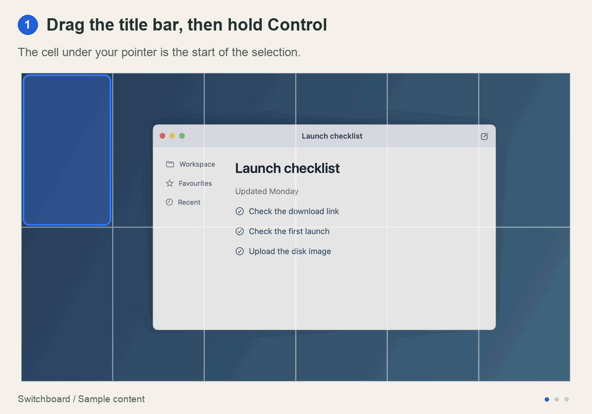

[Drag controls](docs/user-guide.md#snap-by-dragging) · [Still image](docs/images/window-grid-demo.png) · [Download MP4](https://github.com/Mehul72/switchboard/raw/refs/heads/main/docs/videos/window-grid.mp4)

## System

### See what's keeping your Mac busy

Open **System** to see CPU, GPU, memory, network, disk, and power readings. **Using the most** lists processes by CPU or memory. Supported apps have a **Quit** button that lets them ask to save your work.

  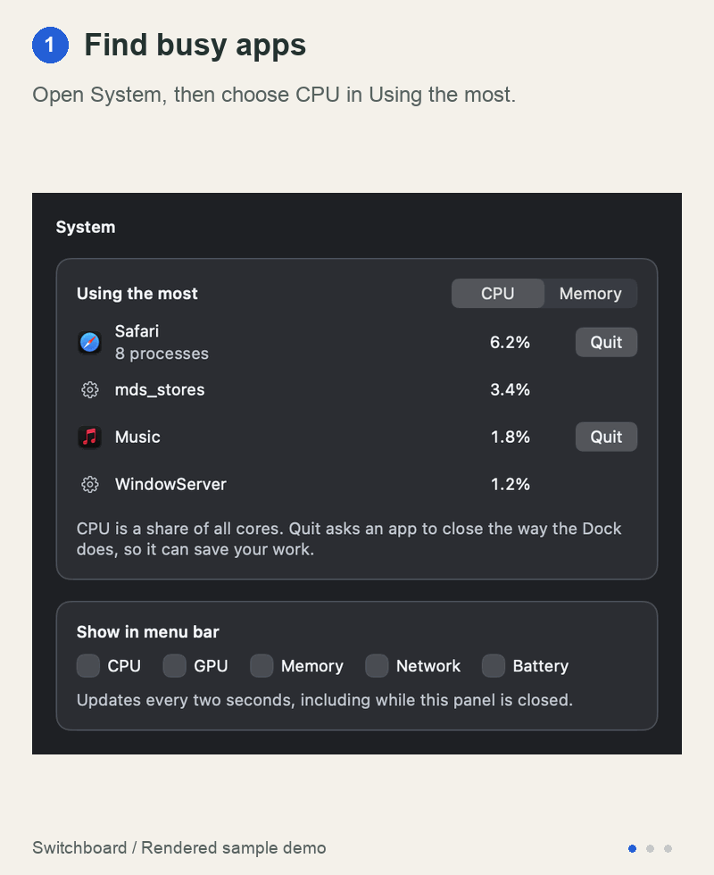

Scroll to **Show in menu bar** and choose the readings you want to keep visible. They update every two seconds with the panel closed. Click the readings to reopen System, or Command-drag them to a different place in the menu bar.

[System guide](docs/user-guide.md#system-monitor) · [Still image](docs/images/system-monitor.png) · [Download MP4](https://github.com/Mehul72/switchboard/raw/refs/heads/main/docs/videos/system-monitor.mp4)

## A few other handy things

- **Keep your Mac awake** for a set time, until an app quits, or while it's plugged in, without remembering to change it back later.
- **Reverse a mouse wheel's scrolling** while keeping your trackpad and Magic Mouse gestures as they are.
- **Quit an app with its last window**, with exceptions you choose under **settings gear > Red Button Never Quits**.
- **Paste plain text** without bringing the old fonts and colours along.
- **Change Finder, screenshot, and Dock settings** from one panel.

Press **Command-F** in the panel to search for a setting. The appearance button beside the gear lets you choose light, dark, or the system theme.

## Install

1. [Download the latest release](https://github.com/Mehul72/switchboard/releases/latest). Under **Assets**, choose `Switchboard-<version>.dmg`.
2. Open the DMG and drag **Switchboard** into **Applications**.
3. Open it from Applications, then choose **Open Switchboard** in the welcome window.

Look for its icon in the menu bar. There's no Dock icon. You can eject the installer once the app is copied, and enable **settings gear > Launch at Login** when you want it ready after signing in.

For a quick first try, copy two different sentences. Open Clipboard and bring the first one back. Allow clipboard access if macOS asks.

Use **settings gear > Check for Updates…** when you want to check for a new version. If one is available, Switchboard links to its download page; you install it yourself.

Five shortcuts worth keeping nearby

| Action | Default shortcut |
| --- | --- |
| Show or hide Switchboard | Control-Option-Command-S |
| Open clipboard history | Control-Option-Command-V |
| Open file shelf and disks | Control-Option-Command-F |
| Copy text from the screen | Control-Option-Command-T |
| Toggle keep-awake | Control-Option-Command-A |

Change bindings in **settings gear > Keyboard Shortcuts**. Inside the panel, **Escape** clears search; press it again to close the panel.

## Your data and permissions

Clipboard history, shelf references, and window previews stay in memory. Quitting clears those items; your original files stay put. JPEG and HEIC clipboard screenshot conversion also creates temporary files, keeping the five most recent until you quit. Switchboard doesn't send clipboard content or usage data to a server.

Once a day, Switchboard asks GitHub for the latest release number so it can tell you about updates. Turn that off with **settings gear > Check for Updates Automatically**.

macOS asks for permissions as you use the tools that need them. Window tools need Accessibility, screen text and optional previews need Screen Recording, and per-app audio needs System Audio Recording. You don't have to enable everything.

The settings gear also lets you turn off automatic clipboard recording, opening the shelf during file drags, and Command-Delete disk eject in Finder.

Use **settings gear > Restore Original Settings** to undo recorded system preference changes, stop the live window/mouse/keep-awake tools, and reset app audio. Appearance, shortcuts, menu bar readings, and the gear's optional behaviors have their own controls.

[Permission details](docs/user-guide.md#permissions) · [Restore settings or uninstall](docs/user-guide.md#restore-settings-or-uninstall)

## Help and contributing

[User guide](docs/user-guide.md) · [Troubleshooting](docs/user-guide.md#troubleshooting) · [Report a bug](https://github.com/Mehul72/switchboard/issues/new?template=bug_report.yml) · [Request a feature](https://github.com/Mehul72/switchboard/issues/new?template=feature_request.yml)

To build it yourself, open `Switchboard.xcodeproj` in Xcode 16 or later, select **Switchboard > My Mac**, choose your signing team if needed, and press **Command-R**. There are no package dependencies in the app.

[Contributing](CONTRIBUTING.md) covers tests, signing, and releases. The [media guide](docs/media.md) covers the images and demos.
