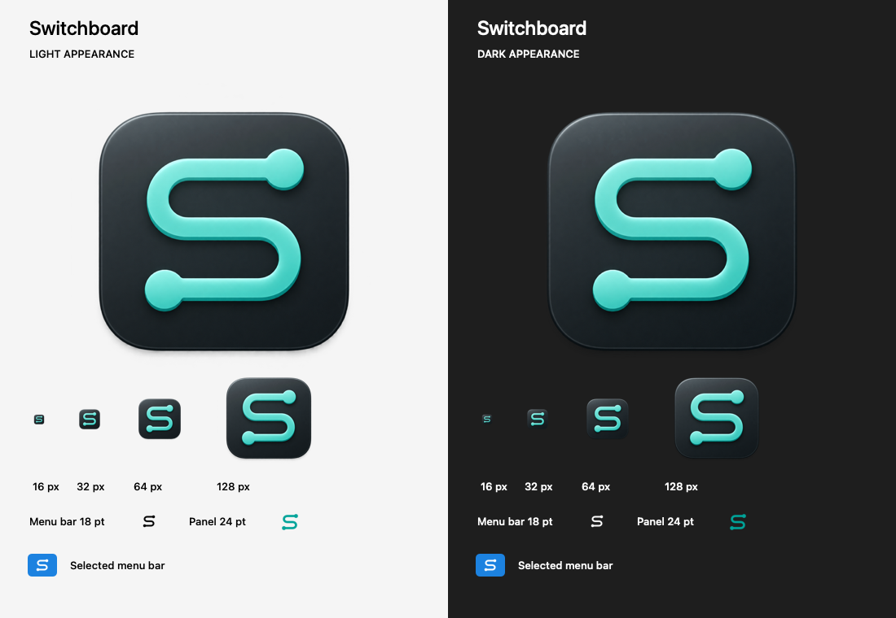

# Switchboard artwork

The routed S connects two terminals, combining Switchboard's initial with a
signal path. The app icon uses a mint-teal trace on a graphite tile. The menu
bar and panel header use the same silhouette as a flat vector mark.



This artwork proof uses the exported icons and the compiled vector asset;
it is not an app screenshot.

## Assets

| Asset | Source | Use |
| --- | --- | --- |
| App icon | [app-icon-master.png](app-icon-master.png) | Transparent 1254 px master, including the tile and its shadow |
| Logo | [BrandMark.svg](../../Switchboard/Assets.xcassets/BrandMark.imageset/BrandMark.svg) | Editable 32 pt vector, transparent background |
| Icon exports | [AppIcon.appiconset](../../Switchboard/Assets.xcassets/AppIcon.appiconset) | All ten macOS asset slots, 16 through 1024 px |

The app icon was created with the built-in image generation tool using
[icon-prompt.txt](icon-prompt.txt). The vector is the optically simplified
version for small UI placements. Its source uses black because macOS tints
template images to match the menu bar appearance, selection and accessibility
contrast. The panel header follows the user's system accent colour.

## Regenerate the app icon sizes

From the repository root on macOS:

```sh
sh scripts/generate-app-icons.sh
```

Keep the transparent padding in the master. Each PNG is exported directly from
the master to avoid cumulative resampling. Xcode packages the icon catalog into
the app, including its Finder icon; no separate checked-in ICNS file is needed.

After changing artwork, build the app and check the smallest icon sizes and
the menu bar in light, dark and selected appearances. Switchboard is a menu bar
app, so it does not normally appear in the Dock.
