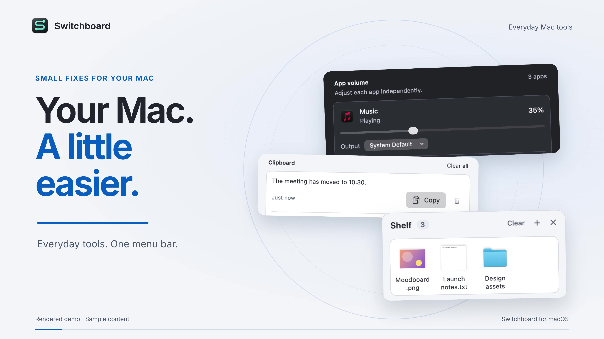
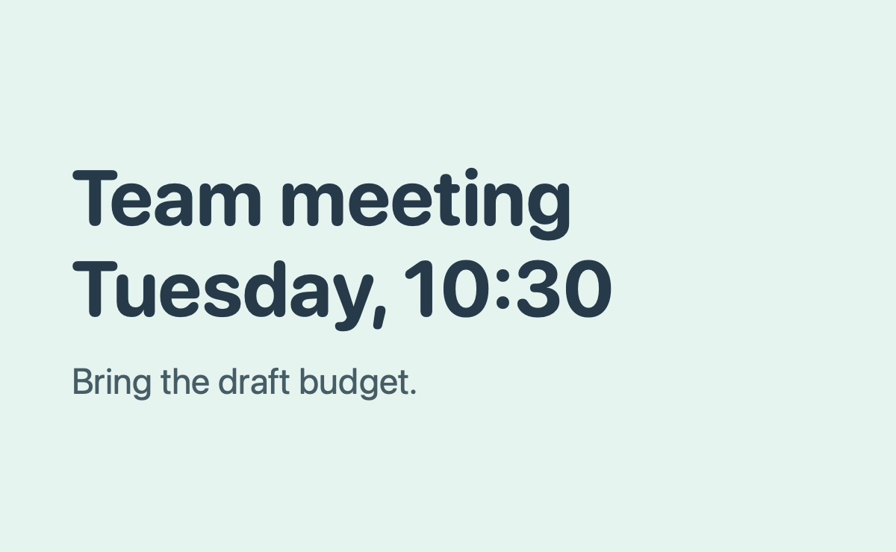
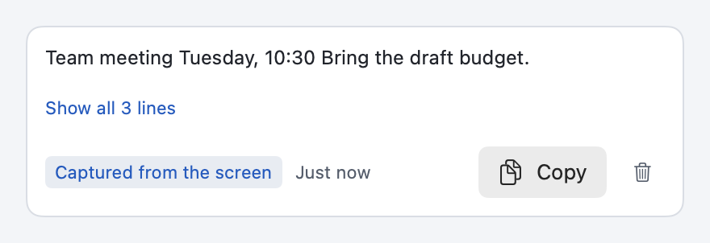
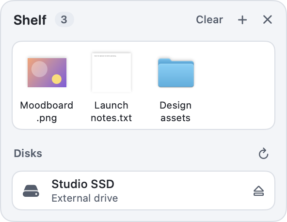
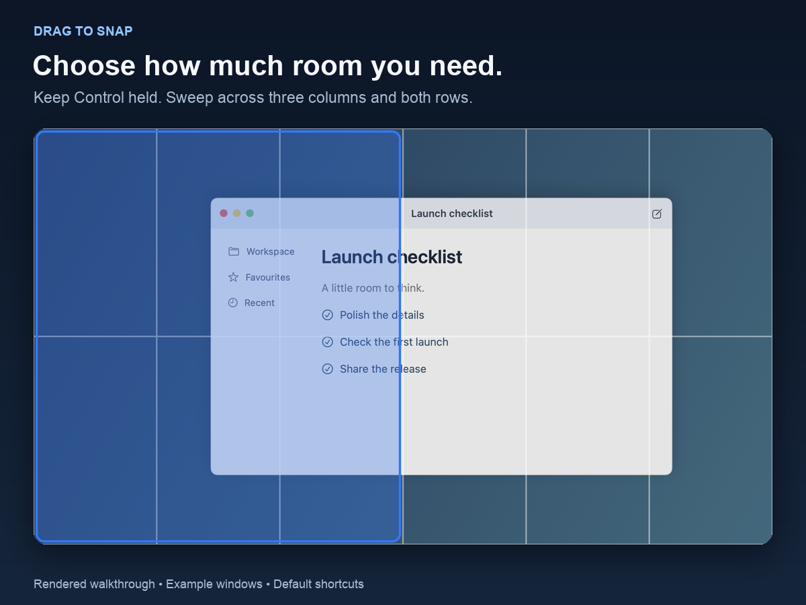
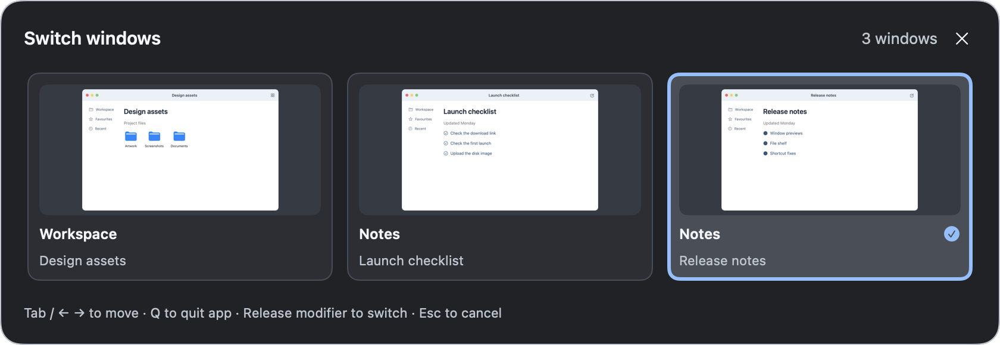
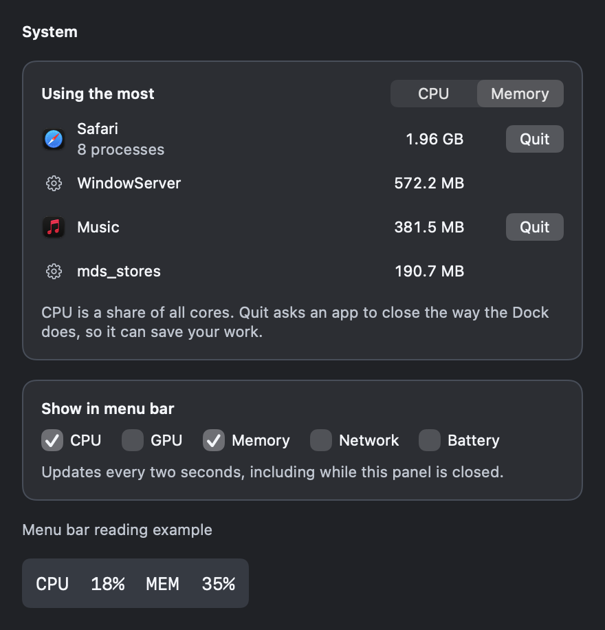

# Switchboard user guide

[Download](https://github.com/Mehul72/switchboard/releases/latest) · [README](../README.md) · [Demos and media](media.md)

Switchboard runs in the menu bar. Click its icon to open the panel, or press **Control-Option-Command-S**. This guide covers setup and the tools you'll find there.

- [30-second tour](#30-second-tour)
- [Installation](#installation-and-first-launch)
- [Settings and everyday tools](#finding-and-changing-settings)
- [Finder and Dock](#finder-and-dock-settings)
- [Audio](#audio)
- [Clipboard](#screenshots-and-clipboard)
- [File shelf and disks](#file-shelf-and-disks)
- [Window snapping](#window-snapping)
- [Window switcher](#window-switcher)
- [Shortcuts](#global-shortcuts)
- [Permissions](#permissions)
- [System monitor](#system-monitor)
- [Troubleshooting](#troubleshooting)
- [Updates](#update-switchboard) and [uninstalling](#restore-settings-or-uninstall)

## 30-second tour

[Watch in 4K](../brag-output/brag.mp4) · [View the poster](../brag-output/brag.jpg)

The tour shows app audio, clipboard history, screen-text capture, the file shelf, window switching, snapping, and System readings. It includes music and uses rendered app views with sample content. You can follow all the instructions below without watching it.

| In the video | Instructions |
| --- | --- |
| Adjust an app's volume and output | [Audio](#audio) |
| Copy an earlier clip | [Clipboard history](#retrieve-an-earlier-copy) |
| Capture words from an image | [Copy text from the screen](#copy-text-from-the-screen) |
| Collect files on the shelf | [File shelf and disks](#file-shelf-and-disks) |
| Choose an individual window | [Window switcher](#window-switcher) |
| Snap a window into place | [Window snapping](#window-snapping) |
| Inspect activity and show menu bar readings | [System monitor](#system-monitor) |

## Installation and first launch

You need macOS 14.2 or later. Check **Apple menu > About This Mac** if you're unsure.

1. Open the [latest release](https://github.com/Mehul72/switchboard/releases/latest) and expand **Assets**. Download `Switchboard-<version>.dmg`. The source-code archives are for building the app yourself.
2. Open the DMG and drag **Switchboard** into **Applications**. Wait for the copy to finish.
3. Open Switchboard from Applications. If macOS asks whether to open the downloaded app, choose **Open**.
4. Choose **Open Switchboard** in the welcome window.
5. Eject the installer in Finder.

There's no Dock icon. From now on, use the menu bar icon or **Control-Option-Command-S**. Keep the app in Applications so permissions and Launch at Login refer to that copy.

The welcome window appears once per installed copy. You'll see it again after replacing the app with an update or reinstalling it.

### Try the clipboard

Copy a sentence, then copy something else. Open **Clipboard** in Switchboard and click **Copy** beside the first sentence. Return to your text editor and paste with **Command-V**.

History records new copies while Switchboard is running and **Record Clipboard History** is on. It clears when you quit. Allow clipboard access if macOS asks; Accessibility and Screen Recording aren't needed for clipboard history.

To have Switchboard open when you sign in, choose **settings gear > Launch at Login**. If it says **Approve Launch at Login…**, choose that and allow Switchboard in macOS Login Items.

If the gear offers **Move Switchboard to Applications…** or **Restart Switchboard from Applications…**, use the installed Applications copy before enabling Launch at Login.

## Finding and changing settings

Press **Command-F** in the panel to search all settings. Try `awake`, for example. **Escape** clears the search; press it again to close the panel.

Tweaks has four categories: Everyday, Files, Capture, and Dock. It remembers the category you last opened. Most changes apply immediately. If a change needs Finder or the Dock to restart, a restart button appears. You can make several changes before using it. Some settings take effect when you reopen the affected apps.

The appearance button beside the settings gear offers **Match System**, **Light**, and **Dark**. This changes Switchboard's windows without changing the rest of macOS.

The images in this guide are native app views rendered with sample content. Window previews and the desktop are examples, and system readings are made up. This guide describes the repository source reviewed on 5 October 2026; an older release may differ. See [Demos and media](media.md) for animated walkthroughs.

Use **settings gear > Restore Original Settings** to put system preferences back to their values before Switchboard changed them. Shortcut bindings are managed separately.

### Choose what runs automatically

These settings in the gear are on by default and remember your choice:

| Setting | What turning it off does |
| --- | --- |
| Record Clipboard History | Stops recording and clears the clips held in memory. |
| Open Shelf During File Drags | Stops Shift and pointer shakes from opening the shelf. The tray button and shelf shortcut still work. |
| Command-Delete Ejects Disks in Finder | Leaves Command-Delete to Finder. The shelf's eject controls still work. |
| Check for Updates Automatically | Stops scheduled checks. **Check for Updates…** still works. |

Window snapping, the window switcher, and menu bar readings start off. Enable the ones you want in **Everyday** or **System**.

## Everyday tools

Open **Tweaks > Everyday**, or search for a tool by name.

### Keep the Mac awake

Open the menu beside **Keep Mac awake** and choose when it should end:

- **30 minutes**, **1 hour**, or **2 hours**. The row counts down the time left.
- **Until I stop it**.
- **Until an app quits**, then choose the app. Use it for an export or download that runs in its own app. Keep awake ends when that app quits, even if you open the app again later.
- **While plugged in**, on Macs with a battery. On battery, keep awake pauses, and it resumes when you plug in again.

Check **Let display sleep** in the same menu to keep the Mac running while the screen turns off. It applies to whichever option you choose, and Switchboard remembers it.

Normal idle sleep resumes when keep awake ends, when you choose **Off**, or when you quit Switchboard.

### Copy text from the screen

Click **Select Area** beside **Copy text from the screen**, or press **Control-Option-Command-T**. Allow Screen Recording if asked, then drag around the words you want. Release the mouse to recognise the text, or press **Escape** to cancel.

Paste with **Command-V**. If **Record Clipboard History** is on, the panel opens Clipboard and labels the result **Captured from the screen**. With history off, the text is copied without being kept in the list. Check it before using it: blurry images and small text can produce mistakes.

The first read can take up to a minute while macOS gets text recognition ready. The panel says **Reading the text…**, and you can keep using Switchboard meanwhile; the text lands on the clipboard when it's done. Wait for it to finish before starting another capture. Switchboard also prepares text recognition in the background after launch when the system build has changed.

Example image and the recognised text

### Mouse scrolling and closing apps

**Traditional mouse scrolling** reverses a physical mouse wheel's direction. It leaves the trackpad and Magic Mouse gestures as they are, so keep your preferred trackpad direction in macOS settings.

**Red button quits the app** asks an app to quit when the red close button closes its last window. Chrome's last-tab close is handled too. The app may still ask you to save your work. Finder and Switchboard are excluded.

To keep another app running after its last window closes, such as a music player, check it under **settings gear > Red Button Never Quits**. Open the app first if it isn't listed. Exclusions are remembered, and an excluded app stays in the menu even when it isn't running so you can uncheck it later.

Both need Accessibility access.

### Paste without formatting

Click **Make Plain** beside **Strip clipboard formatting**, then paste again. This removes the copied text's fonts, colours, and links.

## Finder and Dock settings

Open **Tweaks > Files** to show hidden files, show all file extensions, put the full path in Finder's title, keep folders above files when sorting by name, or search the current folder by default. You can also skip extension-change warnings and hide desktop icons. Hidden desktop files remain in the Desktop folder.

Apply the **Restart Finder** button after making your changes. **No .DS_Store on network drives** takes effect the next time a network drive is mounted.

Open **Tweaks > Dock** to hide recent apps, minimise windows into their app icons, or remove the delay before an automatically hidden Dock appears. **Reveal hidden Dock instantly** requires the Dock's automatic hiding to be enabled in macOS. Apply **Restart Dock** after making changes.

These are saved macOS preferences and remain in effect after Switchboard quits. Use **Restore Original Settings** to undo them.

## Audio

1. Start playback in the app you want to control.
2. Open **Audio** in Switchboard.
3. Move that app's volume slider. Allow **System Audio Recording** when asked, then retry if needed.
4. To send its audio to another device, choose one from its **Output** menu.

Each app has its own volume and output. The apps and devices shown here are examples.

An app appears after it opens an audio stream. If it's missing, start playback and check again.

macOS shows a purple recording indicator while per-app volume or routing is active. Switchboard uses audio taps for these controls, and they work while the app is running.

Output choices are remembered per app across app and Switchboard relaunches. If a chosen device disconnects, the menu says **Chosen device unavailable** and playback falls back to the default output. Reconnecting the device lets Switchboard use it again. Choose **System Default** to make an app follow macOS's current output.

Volume isn't remembered after an app quits or Switchboard relaunches. **Reset app audio** returns all apps to 100% on the system default output, forgets their saved output choices, and releases the audio controls.

**Output devices** has a separate set of sliders for each device's overall volume. Those affect every app using the device and don't need recording access. Device volume stays where you set it when you reset app audio or quit Switchboard.

If a device doesn't support software volume, use its own controls. If a per-app audio control stops responding, Switchboard returns that app to normal volume on the default output and reports the failure. Select its volume and output again to retry.

## Screenshots and clipboard

### Set up screenshots

Open **Tweaks > Capture**. These settings apply to new screenshots without restarting Finder or the Dock:

| Setting | How to use it |
| --- | --- |
| Save screenshots to | Choose an existing folder macOS can write to. |
| Copy screenshots to clipboard | Send captures to the clipboard instead of the screenshots folder. Turn this off to save files again. |
| Screenshot format | Choose PNG, JPEG, or HEIC. |
| Skip the floating thumbnail | Save captures immediately instead of showing the thumbnail. |
| Remove window shadows | Omit shadows from window captures. |

The screenshot location and format are saved macOS preferences. Converting clipboard screenshots to JPEG or HEIC requires Switchboard to remain running with **Copy screenshots to clipboard** enabled.

### Retrieve an earlier copy

Open **Clipboard**, or press **Control-Option-Command-V**, to find something you copied earlier. Click **Copy** beside it, return to your app, and paste with **Command-V**. Switchboard doesn't paste into another app automatically.

History holds up to 20 text and image clips, including at most eight images. Images larger than 8 MB on the clipboard are skipped. Copying the same text or image again moves it to the top instead of creating a duplicate. Expand long entries with **Show more** or **Show all … lines**. A very long clip shows its first 20,000 characters; **Copy** still copies all of it. The trash button removes one entry; **Clear all** clears the list.

History stays in memory and disappears when you quit. Content marked private by a password manager is skipped. Switchboard doesn't send clipboard content or usage data to a server. To stop recording altogether, turn off **settings gear > Record Clipboard History**. That also forgets the clips already held.

If you set clipboard screenshots to JPEG or HEIC, Switchboard converts new captures while it's running. It puts both the image and a matching file on the clipboard. The file is temporary: Switchboard keeps the five most recent and deletes them when it quits. It also clears leftover files at the next launch after a crash or force quit. Some apps still convert pasted images to PNG.

History accepts PNG, JPEG, HEIC, and TIFF images, stores them as PNG, and copies them back as PNG. To keep a converted screenshot's JPEG or HEIC file, paste the new capture into a destination that accepts files before its temporary file is removed.

## File shelf and disks

The shelf holds files while you move between folders or apps. It keeps references to the originals, so it isn't a backup and doesn't move your files.

### Add and use files

1. Start dragging a file or folder from Finder or another app.
2. Press **Shift** once, or shake the pointer quickly from side to side.
3. Drop it onto **Drop to keep**.
4. When you're ready, drag its thumbnail from the shelf into Finder, an email, or another app that accepts files.

Press Shift after the drag starts, without other keys. Holding it before you start dragging won't open the shelf. If the shelf opens when you don't want it, turn off **settings gear > Open Shelf During File Drags**; its shortcut and tray button keep working.

You can also open the shelf with **Control-Option-Command-F** or the tray button beside the settings gear. The **+** button, or **Command-O**, opens a file picker. Press the shelf shortcut again or **Escape** to close it.

The shelf holds up to 40 items. Adding the same file twice doesn't duplicate it. The count beside the menu bar icon tells you how many items you have.

Right-click an item, or use its **…** menu, to **Open**, **Copy File**, **Show in Finder**, or **Remove from Shelf**. Copy File lets you paste into a destination without dragging. Removing an item or choosing **Clear** leaves the original file alone. Dragging an item out offers a copy and keeps it on the shelf for reuse.

Everything on the shelf clears when Switchboard quits. Renamed files stay available when macOS can still locate them. Deleted files and files on disconnected drives are marked unavailable after a refresh. Reconnect the drive or add the file again.

The shelf accepts files and folders. Save browser attachments as files first; links and copied text can't be added.

### Eject a disk

External local drives and mounted disk images appear under **Disks**. Click **Eject** beside a disk, or drag its volume icon, reveal the shelf, and release over **Drop to eject**. Hovering over the target won't eject anything.

Wait for the success message. If the disk is busy, close the files or apps using it and try again. Switchboard doesn't force-eject disks. Internal system volumes and hidden system mounts, such as Xcode Simulator runtimes, aren't listed.

You can select a disk on the shelf and press **Command-Delete** to eject it. For an ordinary shelf item, that shortcut removes the reference and leaves the file in place.

With Accessibility access, **Command-Delete** also ejects disks selected in Finder. This applies only when everything selected is an ejectable disk. Files, including downloaded DMGs, still go to the Trash as usual. While you're renaming an item or typing in Finder, the shortcut keeps its text-editing behaviour. If ejecting fails, the shelf opens with the error. To leave Command-Delete to Finder, turn off **settings gear > Command-Delete Ejects Disks in Finder**.

### Disk images

A downloaded `.dmg` file can go on the shelf too. Drag it onto **Drop to open** to mount it. Once Switchboard knows its mounted volume, the target changes to **Drop to eject**, and its **…** menu includes eject actions.

Ejecting leaves the downloaded DMG file in place. Use **Refresh disks** if the list is out of date.

## Window snapping

Turn on **Tweaks > Everyday > Snap windows** and allow Accessibility access. It's off by default because its shortcuts use combinations other apps may need.

### Snap with the keyboard

Focus a window, then press **Control-Option-Left** to put it on the left half of the screen. **Control-Option-Return** maximises it; **Control-Option-Delete** restores its previous size and position.

The arrow shortcuts move between layouts, so the result depends on where the window is now:

| Key, with Control-Option held | Result |
| --- | --- |
| Up | Maximise. From maximised, move to the top half. |
| Left or Right | From maximised, move to that half, then that third. From a third, move between the three columns. From the left half, Right returns to maximised; from the right half, Left does the same. |
| Down | Extend a top-row layout to full height, then move to the bottom half of that width. From maximised, move to the bottom half. |

Left and Right keep the current row. For example, maximise a window, then press Up and Left to reach the top-left quarter. Left again gives the top-left third. At the edge of the layout map, the Mac beeps.

A window that hasn't been snapped starts at the left half, right half, maximised, or bottom half, depending on the arrow you press.

These shortcuts go straight to a layout:

| Layout or action | Default shortcut |
| --- | --- |
| Top-left / top-right quarter | Control-Option-U / I |
| Bottom-left / bottom-right quarter | Control-Option-J / K |
| Left / centre / right third | Control-Option-D / F / G |
| Left / right two thirds | Control-Option-E / T |
| Maximise | Control-Option-Return |
| Centre | Control-Option-C |
| Restore previous size | Control-Option-Delete |
| Next / previous display | Control-Option-Command-Right / Left |

### Snap by dragging

Start dragging a window by its title bar, then hold **Control**. A grid appears with six columns and two rows. Move across cells to choose the area, then release the mouse to snap. Three columns make a half; two make a third.

The selection starts in the cell under the pointer when you press Control. Release Control before the mouse to cancel snapping and drop the window normally. Without Control, macOS handles the drag as usual.

### Window limits

Maximise fills the available screen without entering macOS full screen. Moving to another display keeps the window's relative size and position. Restore returns to the position before the first snap; moving the window by hand starts a new sequence.

Fixed-size windows keep their size and move to the matching edge. Full-screen windows and Switchboard's own windows can't be snapped; the Mac beeps instead. Turning Snap windows off releases its shortcuts for other apps.

## Window switcher

Turn on **Tweaks > Everyday > Window switcher** and allow Accessibility access. This replaces macOS Command-Tab with a list of individual windows. Two windows from the same app get separate cards.

Example windows with previews enabled.

| Action | Default shortcut |
| --- | --- |
| Next window | Command-Tab |
| Previous window | Command-Shift-Tab |
| Next window in the current app | Option-` |
| Previous window in the current app | Option-Shift-` |

Hold **Command** and press **Tab** to cycle. Release Command to switch. For the current-app shortcuts, hold and release **Option** instead.

While the panel is open, you can also use Tab, Shift-Tab, or the Left and Right arrows. **Return** confirms; **Escape** or an outside click cancels. Hover over a card to select it, or click to switch. The panel opens on the display containing your pointer and scrolls if needed.

Press **Q** to quit the selected app. It may ask about unsaved work. Holding Q quits only that app, and Finder is never quit.

### Previews and missing windows

Choose **Enable Previews** to allow Screen Recording. Without it, you can still switch using app icons and window titles. macOS may ask you to relaunch Switchboard after granting access.

Preview thumbnails stay in memory, never on disk. They refresh when older than two seconds. The cache clears when the Mac sleeps, another user takes over, the feature is disabled, or Switchboard detects that Screen Recording access was removed. If macOS can't capture a window, its card keeps the app icon.

Selecting a minimized window restores it; selecting a hidden app reveals it. Windows on another Space, including full-screen windows, take you to that Space. Recently used windows come first, so Command-Tab returns to the window you just left.

Switchboard can only list windows that macOS exposes through Accessibility. If a window is missing, visit its Space once and try again. This can happen with windows restored to full screen at login. Switchboard's own windows are excluded.

Running apps with no open windows appear under **Apps without windows**. Selecting one brings the app forward without creating a window. The current-app shortcuts list windows only.

Change any of the four bindings in **settings gear > Keyboard Shortcuts**. With a custom binding, hold its Control, Option, or Command modifiers and release any one to switch; Shift changes direction. Disabling the feature or quitting Switchboard brings back native Command-Tab.

## Global shortcuts

These work from any app while Switchboard is running. Each action runs when you release the shortcut key.

| Action | Default shortcut |
| --- | --- |
| Show or hide Switchboard | Control-Option-Command-S |
| Open clipboard history | Control-Option-Command-V |
| Open file shelf and disks | Control-Option-Command-F |
| Copy text from the screen | Control-Option-Command-T |
| Toggle keep-awake | Control-Option-Command-A |

The keep-awake shortcut starts a one-hour session or stops the current one, then opens the panel. Text capture opens the region selector and shows the result afterward. Other shortcuts pause while you're selecting the area, and work again as soon as you've chosen it.

### Customising shortcuts

Open **settings gear > Keyboard Shortcuts**, click a binding, and press the new combination. It must include Control or Option, or Command with another modifier. Window switcher actions also accept Command-Tab.

You can use letters, numbers, punctuation, arrows, Tab, Return, Delete, Space, or F1 to F12. Bindings follow physical key positions; their labels follow your keyboard layout.

While recording, **Escape** cancels, **Delete** disables the shortcut, and **Tab** leaves recording. Each row's menu also has **Restore Default** and **Disable Shortcut**. Changes take effect immediately and survive relaunch.

A global shortcut takes that combination away from other apps. For example, Option with a letter may stop you typing an accented character, and Control-A may stop working as a text editing command.

Conflicts show an error and keep the old binding. If another app or macOS intercepts a combination, choose a different one. For a binding that's unavailable at launch, close the app using it and choose **Retry Unavailable Shortcuts**, or record another combination.

## Permissions

macOS asks for access when you use a feature that needs it. Grant only the permissions for the tools you want to use.

| Feature | Permission |
| --- | --- |
| Clipboard history and clipboard screenshot conversion | Clipboard access, if requested by macOS |
| Traditional mouse scrolling, red-button quit, window snapping and switching, Command-Delete disk eject in Finder | Accessibility |
| Copy text from the screen | Screen Recording |
| Window previews, if enabled | Screen Recording |
| Per-app audio | System Audio Recording |

Manage these in **System Settings > Privacy & Security**. When a feature needs Accessibility or Screen Recording, the notice in the panel has a link that opens the right pane. If a toggle stayed off while you granted access, turn it on again. Screen Recording may need a quit and relaunch.

Registering shortcuts doesn't need extra permission, but the feature they trigger still might. Launch at Login may need approval in **System Settings > General > Login Items**.

## System monitor

Open **System** for CPU, GPU, memory, swap, network traffic, disk space, and battery readings. Graphs cover up to the last two minutes. Network combines Wi-Fi and Ethernet; GPU shows the busiest GPU.

Monitoring resumes when you open the section. With no menu bar readings selected, it pauses when you leave. Wait for **Measuring…** to finish after opening it; **Updates delayed** means the latest reading is over six seconds old.

### What's using the most

**Using the most** lists the five apps or processes using the most CPU or memory. Choose **CPU** or **Memory** above the list. An app's helper processes count toward the app, so a browser appears once with its total and the number of processes behind it.

CPU figures are a share of the whole Mac, like the CPU reading above them. Activity Monitor counts each core as 100%, so its figures are higher. To compare, divide its figure by the number of cores in your Mac.

Click **Quit** beside an app to ask it to quit, like **Quit** in the Dock. The app can still ask you to save your work. There's no Quit button for background processes, processes run by macOS, Finder, or Switchboard. Use Activity Monitor for those.

The list stops reordering while the pointer is over it, so a row doesn't move as you click.

### Readings in the menu bar

Under **Show in menu bar**, check **CPU**, **GPU**, **Memory**, **Network**, or **Battery** to show those readings together in a separate menu bar item. Your choices are remembered. They update every two seconds, including while the panel is closed. Click the readings to open **System**. Uncheck them all to hide the readings. **Battery** appears only on Macs with a battery.

To move the readings, hold **Command** and drag them along the menu bar. Switchboard remembers where you put them.

[System walkthrough](images/system-monitor.gif) · [Video](videos/system-monitor.mp4)

System panel with example readings

An unavailable reading means macOS or your hardware didn't supply it. It doesn't mean zero.

## Troubleshooting

| Problem | What to try |
| --- | --- |
| Can't find the app after opening it | Look in the menu bar or press Control-Option-Command-S. If nothing happens, open Switchboard from Applications. |
| No DMG on the download page | Expand **Assets**. If no DMG is attached, check the [release list](https://github.com/Mehul72/switchboard/releases) or [build from source](../CONTRIBUTING.md#build). |
| macOS won't open the app | Check that you downloaded it from this repository and have macOS 14.2 or later. Download it again. If it's still blocked, report the exact message and release version. Don't disable macOS security protections. |
| A feature stays off after granting access | Check **System Settings > Privacy & Security**, then enable the feature again. Screen Recording may need a relaunch. |
| Audio is empty | Start playback in the app, then reopen Audio. |
| An app has returned to 100% or the default audio output | Volume resets when the app quits. If Switchboard reported that per-app audio stopped responding, select the app's volume and output again. |
| Chosen device unavailable | Reconnect the output device or choose **System Default**. Audio uses the default output while the selected device is disconnected. |
| Purple recording indicator | Per-app audio is active. **Audio > Reset app audio** releases those controls. |
| Text capture says Reading the text… | The first read can take up to a minute. Other controls remain available once the area is selected. Wait for the result before starting another capture. |
| Clipboard history is empty while the app is running | Turn on **Record Clipboard History**, then copy something new. Private clips and oversized images are skipped. Allow clipboard access if macOS asks. |
| Clipboard screenshot conversion reports denied access | Allow Switchboard's clipboard access in System Settings, reselect the screenshot format, and take a new screenshot. |
| A screenshot goes to the clipboard instead of the chosen folder | Turn off **Tweaks > Capture > Copy screenshots to clipboard**, then take a new screenshot. |
| A shortcut does nothing | Check **Keyboard Shortcuts** for disabled or unavailable bindings. Retry unavailable shortcuts or choose another combination. |
| Command-Tab still shows the macOS switcher | Enable **Tweaks > Everyday > Window switcher** and allow Accessibility. |
| Quit didn't close an app | The app may be waiting for you to save, or it may not be responding. Switch to it, or use **Force Quit** in Activity Monitor. |
| A window won't snap | Enable Snap windows, then focus a resizable window outside full screen. Some apps have fixed-size windows. |
| A window is missing from the switcher | Visit its Space once and try again. |
| Shift doesn't open the shelf | Start dragging a file or folder, then press Shift alone. Or use the tray button or Control-Option-Command-F. |
| A shelf item is unavailable | Reconnect its drive, check whether the file moved or was deleted, or add it again. |
| Clipboard or shelf is empty after relaunching | Both clear when Switchboard quits. Original files remain in their folders. |
| A disk won't eject | Close files and apps using it, then retry. Busy disks aren't force-ejected. |
| Launch at Login needs approval | Choose **Approve Launch at Login…** from the gear and allow Switchboard in **System Settings > General > Login Items**. Use the Applications copy. |
| Launch at Login offers Move or Restart instead | Move the app to Applications or choose **Restart Switchboard from Applications…**, then enable Launch at Login. |
| System shows unavailable readings | Wait for a new sample. GPU and battery sensors depend on the Mac; an unavailable reading is not zero. Use **Open Activity Monitor** for another view. |
| Checking for updates fails | Check your internet connection, then try again. GitHub limits how often one network can ask, so a repeated failure can clear on its own within an hour. |

If that doesn't help, [report a bug](https://github.com/Mehul72/switchboard/issues/new?template=bug_report.yml). Include your Switchboard version, macOS version, steps to reproduce it, and the exact error if there is one.

## Update Switchboard

Switchboard checks GitHub for a newer release once a day. The first time it finds one, a notice in the panel links to the release page. To check now, choose **settings gear > Check for Updates…**. While a newer version is known, the gear menu also offers **Update to** followed by the version number, which opens the release page.

The check fetches release metadata from GitHub and compares its version number with your installed version. It does not download or install the app. To stop the daily check, turn off **settings gear > Check for Updates Automatically**; checking by hand still works.

To install an update, quit Switchboard from the settings gear. Download the new DMG from [Releases](https://github.com/Mehul72/switchboard/releases), then drag the new app into Applications and replace the old copy. Open it from Applications again.

The welcome window appears for the new copy. Clipboard history and the shelf start empty.

## Restore settings or uninstall

**Restore Original Settings** restores the system preferences Switchboard recorded before changing them, stops keep awake, disables mouse-wheel reversal, red-button quit, window snapping and switching, and resets per-app audio. Apply any requested Finder or Dock restart. If a restore fails, the panel reports it so you can retry.

Appearance, shortcut bindings, menu bar readings, the gear's optional behaviours, red-button exclusions, update-check preference, and Launch at Login are managed separately.

1. To undo system preference changes, choose **settings gear > Restore Original Settings** before removing the app. Apply any requested Finder or Dock restart.
2. Choose **Audio > Reset app audio** to return apps to full volume on the system default output. Overall device volume is separate; adjust it if needed.
3. If enabled, choose **Disable Launch at Login** from the settings gear.
4. Choose **Quit Switchboard**.
5. Move **Applications > Switchboard** to the Trash.

Quitting clears clipboard history, shelf references, and window previews. It restores native Command-Tab, but it doesn't undo persistent Finder, Dock, screenshot, or device-volume changes. Original files stay in place. Shortcut customisations are managed separately in **Keyboard Shortcuts**.
