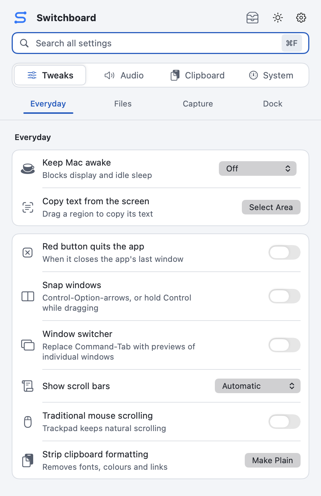
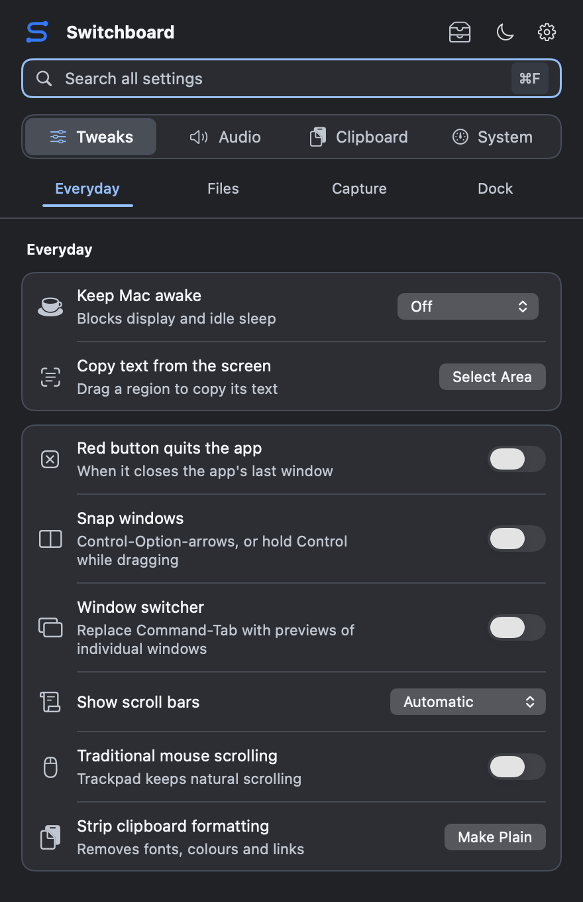
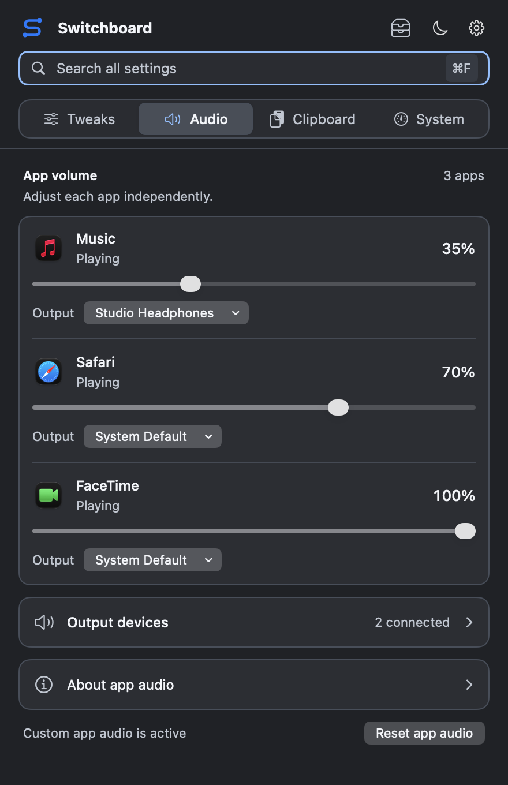
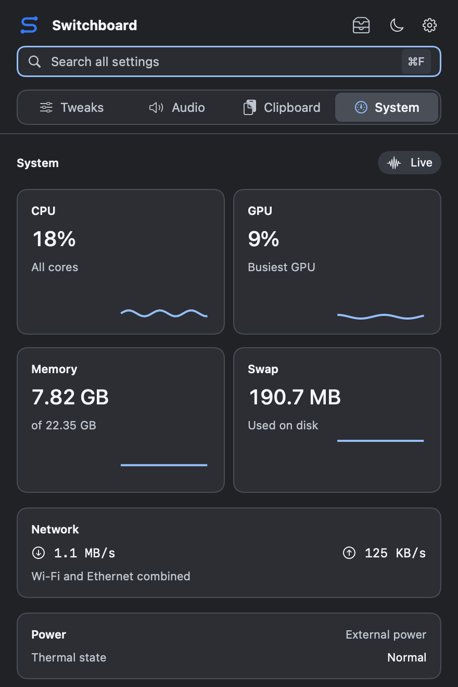

# Switchboard user guide

[Download Switchboard](https://github.com/Mehul72/switchboard/releases/latest) · [Back to the README](../README.md)

## Find your way

[First launch](#installation-and-first-launch) · [Everyday tools](#everyday-tools) · [Audio](#audio) · [Clipboard](#screenshots-and-clipboard) · [Shelf](#file-shelf-and-disks) · [Windows](#window-snapping) · [Switcher](#window-switcher) · [System](#system-monitor) · [Troubleshooting](#troubleshooting)

## Installation and first launch

You need **macOS 14.2 or later**. Check your version in **Apple menu > About This Mac**.

1. Open the [latest release](https://github.com/Mehul72/switchboard/releases/latest). Under **Assets**, download `Switchboard-<version>.dmg`. The source-code ZIP and TAR files are for developers.
2. Open the DMG. Drag **Switchboard** onto **Applications**, and wait for the copy to finish.
3. Open **Finder > Applications > Switchboard**. If macOS asks whether to open the downloaded app, choose **Open**.
4. In the welcome window, choose **Open Switchboard**. Afterward, open the panel from its menu bar icon or **Control-Option-Command-S**. Switchboard has no Dock icon.
5. Eject the installer in Finder. Keep the installed app in Applications so permissions and Launch at Login refer to that copy.

The welcome window appears once per installed copy. Replacing the app with an update or reinstalling it shows the welcome again; ordinary relaunches do not.

### Your first five minutes

**Start with the clipboard.** Copy `Hello, Switchboard`, then copy another sentence. Open **Clipboard** in the panel. Click **Copy** on the first item, return to a text editor, and paste with **Command-V**. No extra permission is needed.

**Find a setting.** Press **Command-F** in the panel and type `awake`. The search spans all sections. Press **Escape** to clear the search and return to browsing.

**Pick your appearance.** The appearance button between the tray and gear offers **Match System**, **Light**, and **Dark**. It changes Switchboard's windows without changing macOS.

**Make it available tomorrow.** Choose **settings gear > Launch at Login**. If the menu changes to **Approve Launch at Login…**, open it and allow Switchboard in macOS Login Items.

You can now use the panel without enabling every tool. Window snapping and the window switcher are off until you choose to turn them on.

See the current panel in light and dark

Native views rendered with sample state. The guide's images are illustrations of the current source; an older installed release may differ.

## Finding and changing settings

Search across all settings with **Command-F**. **Escape** clears the search;
press it again to close the panel. Tweaks are grouped into Everyday, Files,
Capture, and Dock. Your last category is remembered when you return to Tweaks.

Most changes apply immediately. Settings that need Finder or the Dock to restart
show a restart button, so you can apply several changes together. Some global
settings take effect when affected apps reopen.

The **appearance button** beside the settings gear switches Switchboard between
**Match System** (the default), **Light**, and **Dark**. It applies to every
Switchboard window, including the shelf, window switcher, shortcut settings,
and welcome screen, and leaves the macOS setting unchanged.

The settings gear contains **Keyboard Shortcuts**, **Launch at Login**,
**Restore Original Settings**, and **Quit Switchboard**. Restore Original
Settings puts system preferences back to the values they had before Switchboard
changed them. Shortcut bindings are managed separately.

## Everyday tools

[Still image](images/screen-text.png). The text shown was recognised from the example image by the app's OCR.

Open **Tweaks > Everyday**, or search for the tool by name with **Command-F**.

| Task | What to do | What to expect |
| --- | --- | --- |
| Keep a task visible without the Mac going idle | Choose a duration beside **Keep Mac awake**. | The row shows the remaining session time. Normal idle sleep resumes when it ends or you turn it off. |
| Copy text you cannot select | Click **Select Area** beside **Copy text from the screen**, allow Screen Recording if asked, then drag across the text. | Recognised text is copied to the clipboard and available in history. Escape cancels the selection. |
| Use traditional scrolling with a mouse | Enable **Traditional mouse scrolling** and grant Accessibility access. | Mouse scrolling changes; the trackpad keeps natural scrolling. |
| Quit an app with its last window | Enable **Red button quits the app** and grant Accessibility access. | Closing its last window requests a normal quit; an app may still ask to save changes. |
| Remove formatting from copied text | Click **Make Plain** beside **Strip clipboard formatting**. | Paste again to use plain text without its original fonts, colours, or links. |

The **Files**, **Capture**, and **Dock** categories contain Finder, screenshot, and Dock preferences. Read each setting's description before changing it. If a restart button appears, use it when you are ready to apply those changes.

## Global shortcuts

These shortcuts work from any app while Switchboard is running. The five
actions below run once when you release the shortcut key.

| Action | Default shortcut |
| --- | --- |
| Show or hide Switchboard | Control-Option-Command-S |
| Open clipboard history | Control-Option-Command-V |
| Open file shelf and disks | Control-Option-Command-F |
| Copy text from the screen | Control-Option-Command-T |
| Toggle keep-awake | Control-Option-Command-A |

Keep-awake starts a one-hour session when off and stops any active session,
then opens the panel so you can see the new state.
Text capture opens the region selector directly, then shows the result in the
panel. Other shortcuts are paused while a capture is in progress.

## File shelf and disks

[Still image](images/file-shelf-workflow.png).

Start dragging files or folders from Finder or any other app, then either
**shake the pointer** quickly from side to side or **press Shift** once. The shelf
opens beside the pointer; move onto **Drop to keep** and release. Shift already
held when the drag began, or pressed with other keys, does not count. You can
collect up to
40 items from different folders; adding the same file again does not duplicate it.
The number beside the menu bar icon shows how many items are on the shelf.

To open the shelf without dragging, press **Control-Option-Command-F**, or click
the **tray icon** beside the settings gear in the main panel. Change the shortcut
in **settings gear > Keyboard Shortcuts**. Press it again or press **Escape** to
close the shelf. The **+** button (or Command-O) opens a file picker.

Drag a file's thumbnail out of the shelf into Finder, an email, or another
app that accepts files. The shelf offers a copy, leaving the original in place,
and keeps the reference for reuse. Hover over an item and click **…**, or
right-click it, for **Open**, **Copy File**, **Show in Finder**, and **Remove from
Shelf**. Copy File is also a keyboard-accessible way to transfer a file: paste it
into the destination app. **Remove from Shelf** and **Clear** remove references,
never the original files.

The shelf stays in memory and clears when Switchboard quits. References follow
renamed files when macOS can resolve them. Deleted files and files on disconnected
drives are marked unavailable when the shelf refreshes. Reconnect the drive or
add the file again. Browser links, copied text, and attachments that have not yet
been saved as files are not accepted.

[Still image](images/disk-eject.png). Example disk states; no real disk was ejected for this walkthrough.

**Disks** lists external local volumes and mounted disk images. Click a
disk's **Eject** button, or drag its volume icon, shake or press Shift, and release
over the labelled **Drop to eject** target. Hovering or dropping a disk elsewhere in
the panel does not eject it. Internal system volumes are excluded. Eject shows
progress, reports success only after macOS completes it, and shows an error if
the disk is busy or no longer available. There is no force-eject action.
You can also click a disk, or a shelved disk image that is open, and press
**Command-Delete** to eject it. On any other shelf item, Command-Delete removes it
from the shelf and leaves the original file in place.

Command-Delete also ejects disks selected in **Finder**, on the desktop or in a
Finder window. It acts only when everything selected is an ejectable disk; files,
including a downloaded .dmg file, still go to the Trash as usual. This needs
Accessibility access for Switchboard. If an eject fails, the shelf opens to show
why.
Hidden system mounts, such as Xcode Simulator runtimes, are not listed.

A downloaded **.dmg file** can be held on the shelf. While dragging it, **Drop to
open** opens the image; if its mounted volume is already known, **Drop to eject**
appears instead. Mounted volumes also appear under Disks, and a shelved DMG's
**…** menu includes their eject actions. Ejecting an image leaves the downloaded
DMG file in place. Use **Refresh disks** if the list needs updating.

## Window snapping

[View the still image](images/window-snapping.png). The example window's positions are calculated by Switchboard's layout code.

Switch on **Snap windows** in Everyday. It needs Accessibility access and is
off by default, because its shortcuts take common Control-Option combinations
away from other apps. While it is off, window shortcuts are not registered, but
you can still change their bindings.

**Arrow keys.** Control-Option-arrows move a window around a map of layouts:

- **Up** maximises from any layout. From maximised, Up gives the
  top half.
- Left from maximised gives the left half, then the left third. Right from
  the left half goes back to maximised. From any third, Left and Right move
  between the left, centre, and right thirds.
- Left and Right keep a window's row, so maximise, Up, Left gives the
  top-left quarter, and Left again the top-left third.
- **Down** joins a top-row layout back to full height, then gives the bottom
  half of that width. Maximised plus Down is the bottom half of the screen.
- A window that is on no layout starts at the left half, right half, maximised
  (Up), or bottom half (Down). At the edge of the map the Mac beeps.

[View the still image](images/window-grid.png).

**Dragging.** Start dragging a window by its title bar, then hold **Control**.
A grid of six columns and two rows appears. The cell under the pointer when you
press Control is where the layout starts; move across cells to extend it, then
release the mouse. Three columns make a half and two make a third. Release
Control before the mouse to drop the window normally. Option is not used
because macOS uses it for its own tiling during a drag.

**Other shortcuts** jump straight to a layout:

| Action | Default shortcut |
| --- | --- |
| Top-left, top-right, bottom-left, bottom-right quarter | Control-Option-U, I, J, K |
| Left, centre, or right third | Control-Option-D, F, G |
| Left or right two thirds | Control-Option-E, T |
| Maximise | Control-Option-Return |
| Centre | Control-Option-C |
| Restore previous size | Control-Option-Delete |
| Move to next or previous display | Control-Option-Command-Right or Left |

Shortcuts act on the focused window of the frontmost app. Maximise fills the
screen without entering full screen. Moving to another display keeps the
window's relative position and size. Restore returns a window to where it was
before its first snap or drag; moving the window by hand starts a new run. Windows that
cannot be resized keep their size and move against the matching screen edge.
Full-screen windows and Switchboard's own windows are not moved; the Mac beeps
instead.

## Window switcher

[View the still image](images/window-switcher.png). Native switcher view with example window content; no personal desktop content is captured.

Switch on **Window switcher** in Everyday and allow **Accessibility** access.
The feature is off by default. When enabled, it replaces the macOS Command-Tab
switcher with individual windows, so two Finder windows or two browser windows
get separate cards.

| Action | Default shortcut |
| --- | --- |
| Next window across apps | Command-Tab |
| Previous window across apps | Command-Shift-Tab |
| Next window of the current app | Option-` |
| Previous window of the current app | Option-Shift-` |

Keep Command held and press Tab again to cycle. Release Command to focus the
selected window. For the current-app shortcuts, hold and release Option instead.
While the preview panel is open, Tab, Shift-Tab,
Left and Right move the selection; Return confirms and Escape cancels. Moving
the pointer over a card selects it, and clicking a card switches to it.
Cancelling leaves your original window focused. The panel appears on the
display containing the pointer and scrolls when there are more windows than fit.

Apps that are still running with all their windows closed appear after the
window cards under **Apps without windows**, most recently used first, with an
icon and no preview. Choosing one brings the app forward without opening a
window, like the macOS switcher. The current-app shortcuts list windows only.

Press **Q** while the panel is open to quit the selected card's app, as with
the macOS switcher. The app may still ask about unsaved changes. Its cards
disappear once it quits and the switcher stays open. Holding Q quits only one
app, and Finder is never quit.

Choose **Enable Previews** in the switcher to allow **Screen Recording**.
Without it, the same controls work with app icons and window titles. Previews
cover windows on other Spaces, full-screen apps, minimized windows and hidden
apps. Each card is captured when the open panel first shows it, selected card
first, so a quick press and release captures nothing. Small thumbnails stay in
memory so the next opening shows them at once, and are refreshed when older
than two seconds. They are never written to disk. Thumbnails of closed windows
are dropped the next time the switcher opens, and all of them are discarded
when the Mac sleeps, another user takes over the screen, the feature is
switched off, or the switcher finds Screen Recording turned off. A window macOS
will not capture keeps its app icon. macOS may require relaunching Switchboard
after granting access.

Minimized windows are restored when selected, and hidden apps are revealed.
Windows on other Spaces, including full-screen apps, are listed, and choosing
one moves to its Space. Cards follow the order you last used each window, on
any Space, so Command-Tab goes back to the window you came from. Windows not
used since Switchboard started follow, in stacking order and by when their app
was last active. Only windows exposed by macOS Accessibility are
listed, and Switchboard's own windows are excluded. While the switcher is on,
Switchboard notes each Space's windows as you visit it, so a second full-screen
window of the same app stays listed. A window that has not been shown since
Switchboard started, such as one macOS restored into full screen at login, can
be missing unless it is its app's main window; showing its Space once fixes that.

All four bindings can be changed in **settings gear > Keyboard Shortcuts**.
With a custom shortcut, hold its Control, Option or Command modifiers and
release any one to switch. Shift only affects direction. Turning the feature
off releases its shortcuts and closes any open switcher. Native Command-Tab
returns when the feature is disabled or Switchboard quits. Existing saved
Option-Tab defaults migrate to Command-Tab once; custom and disabled bindings stay as set.

## Customising shortcuts

Open **settings gear > Keyboard Shortcuts** to customise a binding. Click its
shortcut button and press a combination containing Control or Option, or
Command with another modifier. Window switcher actions also accept Command-Tab.
Use letters, numbers, punctuation, arrows,
Tab, Return, Delete, Space, or F1 to F12. A global shortcut takes the combination
away from every app: Option plus a letter stops typing characters such as å, and Control plus a
letter can replace text editing keys such as Control-A. Bindings follow physical key positions; labels reflect the keyboard layout.
Press **Escape** to cancel, **Delete** to disable, or **Tab** to leave recording.
Each row's options menu also provides **Restore Default** and **Disable Shortcut**.
Changes take effect immediately and survive relaunch.

Conflicting shortcuts show an error and keep the previous binding. macOS or
another app may consume a combination before the recorder receives it; choose
another if that happens. If a saved shortcut is unavailable at launch, close
the app using it and choose **Retry Unavailable Shortcuts**, or record another.

Global shortcut registration needs no additional permission. Screen text
capture still needs Screen Recording access, and window snapping needs
Accessibility. The window switcher also needs Accessibility, with optional
Screen Recording for previews.

## Permissions

macOS asks for access when you first use a feature that needs it.

| Feature | Permission |
| --- | --- |
| Traditional mouse scrolling, red-button quit, window snapping and switching, Command-Delete to eject disks in Finder | Accessibility |
| Copy text from the screen | Screen Recording |
| Window previews (optional) | Screen Recording |
| Per-app audio controls | System Audio Recording |

If a toggle stays off while you grant access, enable it again afterward.
Permissions are managed in **System Settings > Privacy & Security**. Launch at
Login may also need approval under **General > Login Items**.

## Audio

[Still image](images/app-audio.png).

1. Play something in the app you want to control.
2. Open Switchboard and select **Audio**.
3. Move that app's volume slider. Allow **System Audio Recording** when asked, then retry the adjustment if needed.
4. To route it elsewhere, choose a connected device from the app's **Output** menu.

See per-app volume and output controls

Sample apps and output devices; your list depends on what's running and connected.

Apps appear after opening an audio stream. Lowering an app's volume or choosing
another output uses a Core Audio tap, so macOS shows a purple recording indicator
while that control is active. These controls work while Switchboard is running.

**Reset app audio** returns apps to full volume on the system default output and
releases their taps. A chosen output is remembered per app; if it disconnects,
playback falls back to the default output.

Expand **Output devices** to control a device's overall volume. These sliders
affect every app using that device and do not need recording access. Device
volume changes remain in place when app audio is reset or Switchboard quits.

## Screenshots and clipboard

Switchboard remembers up to **20 recent text and image clips** copied while it is running. Open **Clipboard** or press **Control-Option-Command-V**, find an item, and click **Copy**. Return to your destination app and paste with **Command-V**. Copying an item back does not paste it into another app automatically.

Expand longer entries with **Show more** or **Show all … lines**. The trash button removes an entry; **Clear all** clears history. Images are limited to eight entries, up to 8 MB each.

See clipboard history

When clipboard screenshots are set to JPEG or HEIC, Switchboard converts new
captures while it runs. The clipboard includes the chosen format and a matching
file. Some receiving apps still convert image data to PNG when pasting.

Clipboard history stays in memory and is cleared when Switchboard quits.
Content marked private by a password manager is skipped. Switchboard does not
send clipboard content or usage data to a server.

## System monitor

Open **System** to see CPU, GPU, memory, swap, network traffic, disk space, and battery readings. Monitoring resumes when the section is shown. A reading marked unavailable means macOS or your hardware did not supply it; it is not a zero reading.

See the system monitor

These readings are sample data, not a performance benchmark.

## Troubleshooting

| What you see | What to try |
| --- | --- |
| No app window after launch | Look in the top menu bar or press Control-Option-Command-S. If nothing happens, open the installed app from Applications. |
| The download page has no DMG | Expand **Assets** on the release page. You want the `.dmg`, not **Source code**. If none is attached, check the [release list](https://github.com/Mehul72/switchboard/releases) or [build from source](../CONTRIBUTING.md#build). |
| macOS refuses to open the downloaded app | Confirm it came from this repository's release page and that your macOS version meets the requirement. Download the DMG again. If it is still blocked, report the exact message and release version; do not disable macOS security protections. |
| A feature stays off after allowing access | In **System Settings > Privacy & Security**, confirm Switchboard is allowed, then enable the feature again. Screen Recording may need a quit and relaunch. |
| Audio shows no apps | Start playback in the target app and reopen Audio. An app must open an audio stream to appear. |
| A purple recording indicator appears | Per-app volume or routing is active. **Audio > Reset app audio** releases the taps. [More about audio](#audio). |
| A shortcut does nothing | Open **settings gear > Keyboard Shortcuts**. Check for disabled or unavailable bindings. Use **Retry Unavailable Shortcuts** if shown, or choose another combination. |
| Command-Tab still uses the macOS switcher | Enable **Tweaks > Everyday > Window switcher** and allow Accessibility. |
| A window will not snap | Focus a resizable, non-full-screen window and check that Snap windows is on. Some apps expose fixed-size windows. |
| A window is missing from the switcher | Visit its Space once and try again. Only windows exposed by macOS Accessibility can be listed. |
| The shelf does not open with Shift | Begin dragging an actual file or folder first, then press Shift alone. Holding Shift before the drag does not trigger it. Use the tray button or Control-Option-Command-F as an alternative. |
| A shelved file is unavailable | Reconnect its drive, check whether it was moved or deleted, or add the file again. The shelf stores references, not backup copies. |
| A disk cannot eject | Close files and apps using it, then retry. Switchboard reports busy disks and does not force-eject them. |
| Launch at Login needs approval | Choose **Approve Launch at Login…** from the gear and allow it under **System Settings > General > Login Items**. Run the Applications copy. |

Still stuck? [Report a bug](https://github.com/Mehul72/switchboard/issues/new?template=bug_report.yml) with the Switchboard release version, macOS version, steps, and what happened. A screenshot of the error helps.

## Update Switchboard

Quit Switchboard from the settings gear. Download the new DMG from [Releases](https://github.com/Mehul72/switchboard/releases), open it, and drag the new app into Applications, replacing the old copy. Launch from Applications again. Your in-memory clipboard and shelf start empty; the welcome window appears for the new copy.

## Restore settings or uninstall

1. If you want to undo system preference changes, choose **settings gear > Restore Original Settings** before removing the app. This uses the values saved before Switchboard changed them. Apply any requested Finder or Dock restart.
2. In **Audio**, choose **Reset app audio** to return apps to full volume on the system default output. Overall output-device volume is separate; adjust it yourself if needed.
3. If enabled, choose **Disable Launch at Login** from the settings gear.
4. Choose **Quit Switchboard**. Its clipboard history, shelf references, and thumbnail cache disappear. Original files remain, and native Command-Tab returns.
5. To uninstall, move **Applications > Switchboard** to the Trash.

Quitting alone does not reverse persistent Finder, Dock, screenshot, or device-volume changes. Shortcut customisations are managed separately in **Keyboard Shortcuts**.
